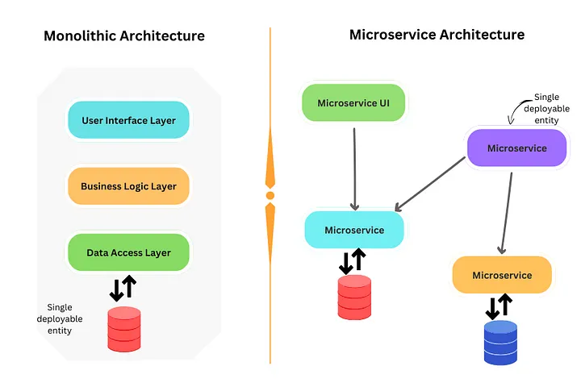
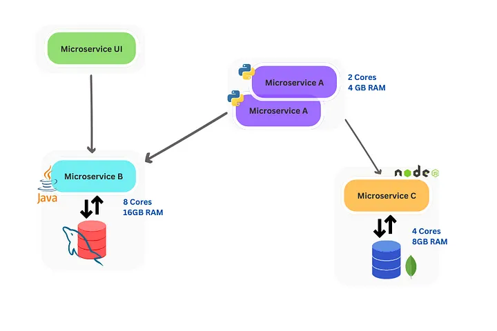
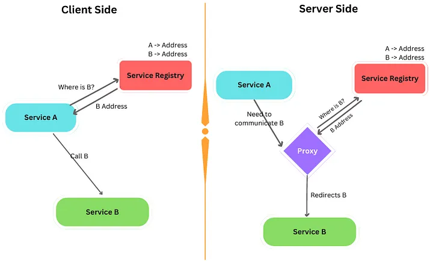

### Advantages of Microservices

Technology independence— 
Microservices solve the technology barrier as they will work on integrating different languages. You are free to use any technology stack, library, or framework for writing each service. This is known as polyglot programming.
- Resilient — 
If one microservice fails, the rest of the application can work without that.
Agility —
- Makes the development and deployment process quick and efficient.
Upgrades — 
With this architecture, we can upgrade only a specific part of the application. Updates of services with zero downtime are possible with some tools. ( Kubernetes )

- Scaling — 
Much easier to scale. Can scale isolated services — Duplicating parallel clones of the microservices. Then can scale in/out easily per demand.
- 
- Flexible and Rapid Deployment — Loose coupling between the processes allows for separate deployments. Also can allocate different resources to each service independently.

## Concepts of Microservice architecture

There are some essential concepts that every developer should know about microservice architecture.

## 1) Communication

One of the biggest challenges in microservices-based applications is the communication mechanism. Unlike monolith, there will be so many services in distributed nature that are trying to communicate with each other.
There are several ways that services can communicate in a microservice architecture.

- API calls
- Message Based Communication
- Service Mesh

 
There are two types of service discovery

Client-side Service Discovery
— Consumer service (client) queries the service registry, acquires the IP address, selects an instance, and makes the request. Here the service has to do the load balancing and send the request directly to the other microservice.

Server-side Service Discovery 
— This decouples the service discovery and load balancing logic from the client. There will be a proxy (which can inbuild into the service registry) to handle the request and call the respective service. Here the load balancing happens at the proxy.

## 2) API Gateway

We learned how communication happens between microservices. But how does the client access those microservices?

we can use
- express proxy pass
- express-gateway
- nginx for proxy pass